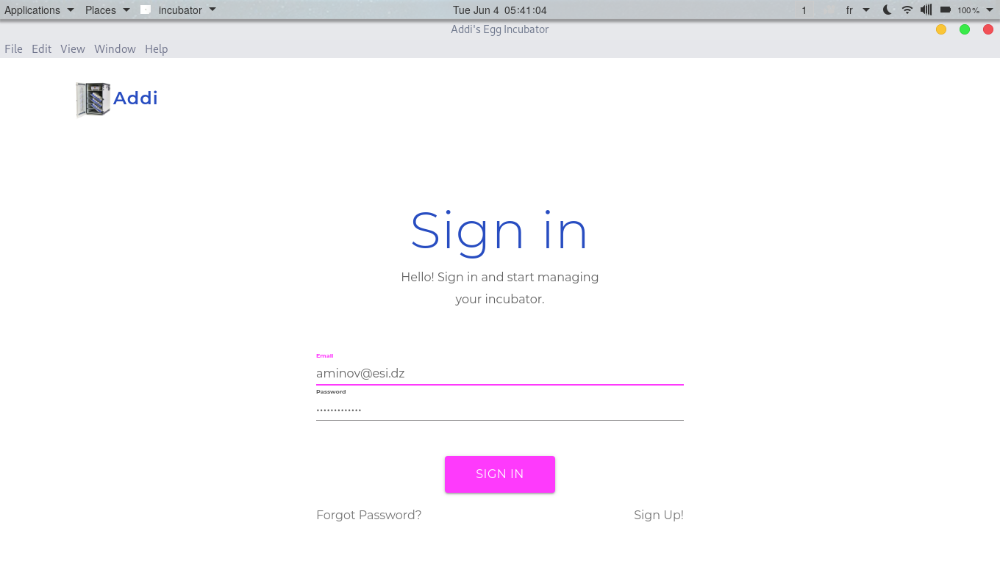
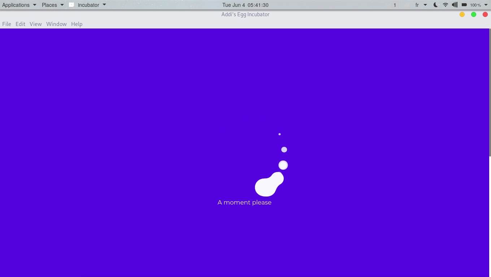
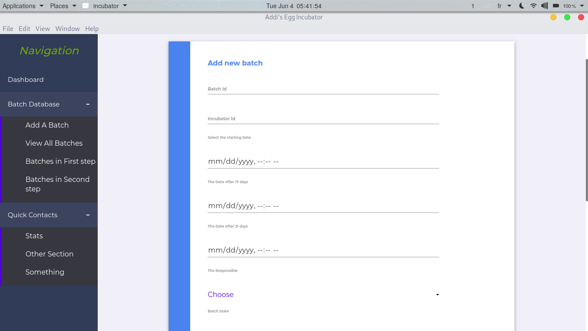
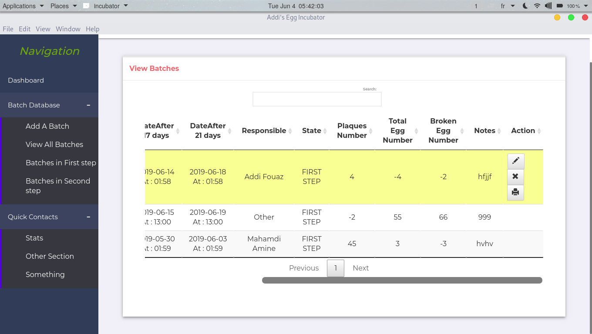
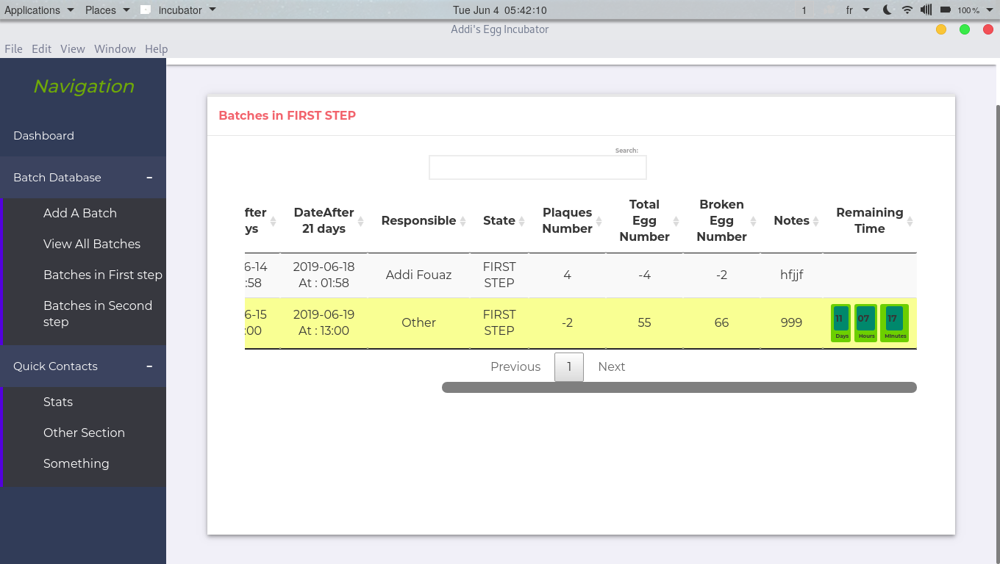
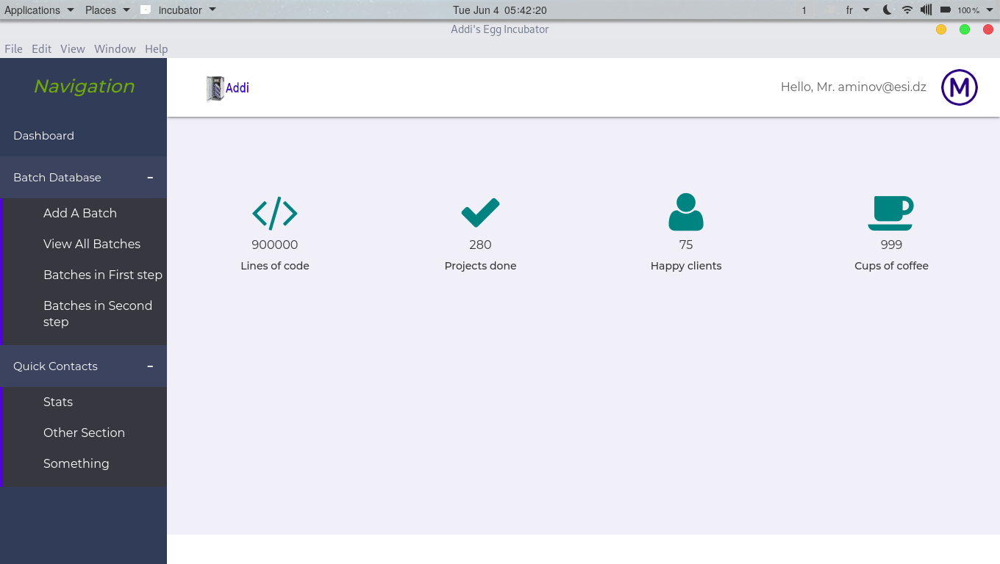

# incubator
-----
* An app to manage egg incubators.

# TAGS
-----
Electron, child_process, python3 backend, sqlite3, jsPDF, spawn, file-exec, datatables, authentication.

# Features
-----
* Sign up
* Sign in
* Recover account 
* Statistics
* Automatic PDF reports for each Batch
* Add Edit Delete Batches 
* View remaining days
* View the batches in the 17 ,21 days steps
* Sqlite3 database with backup option
* And More!

# Demo
-----











# Usage
-----
```
 $ git clone https://github.com/MahamdiAmine/incubator.git
 $ cd incubator
 $ npm i
 $ npm start

```
# In case of sqlite3 problem
-----
```
npm install --save electron-rebuild
./node_modules/.bin/electron-rebuild -w sqlite3 -p
```
# Start
-----
npm start

# Build packager
-----
*For Linux: npm run package-linux
*For Windows: npm run package-win64
*For Mac-OS: not tested.

# Authors
-----
* Mahamdi Amine 
https://github.com/MahamdiAmine


# Licence
-----
MIT licence:
https://www.gnu.org/licenses/gpl-3.0